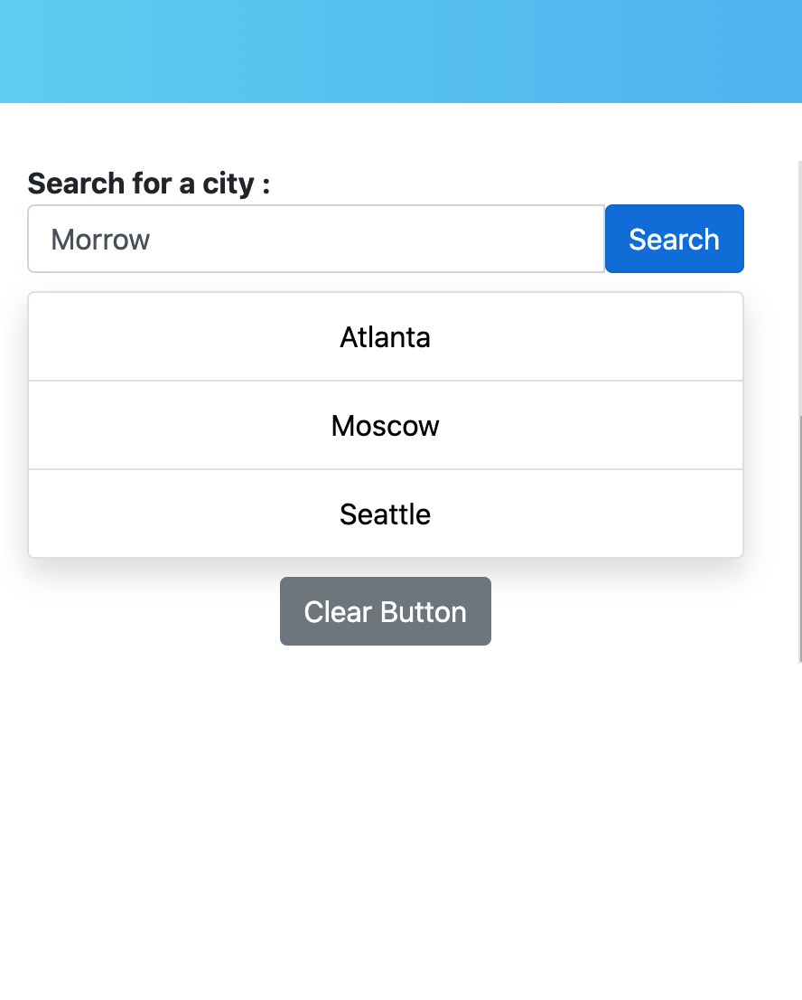
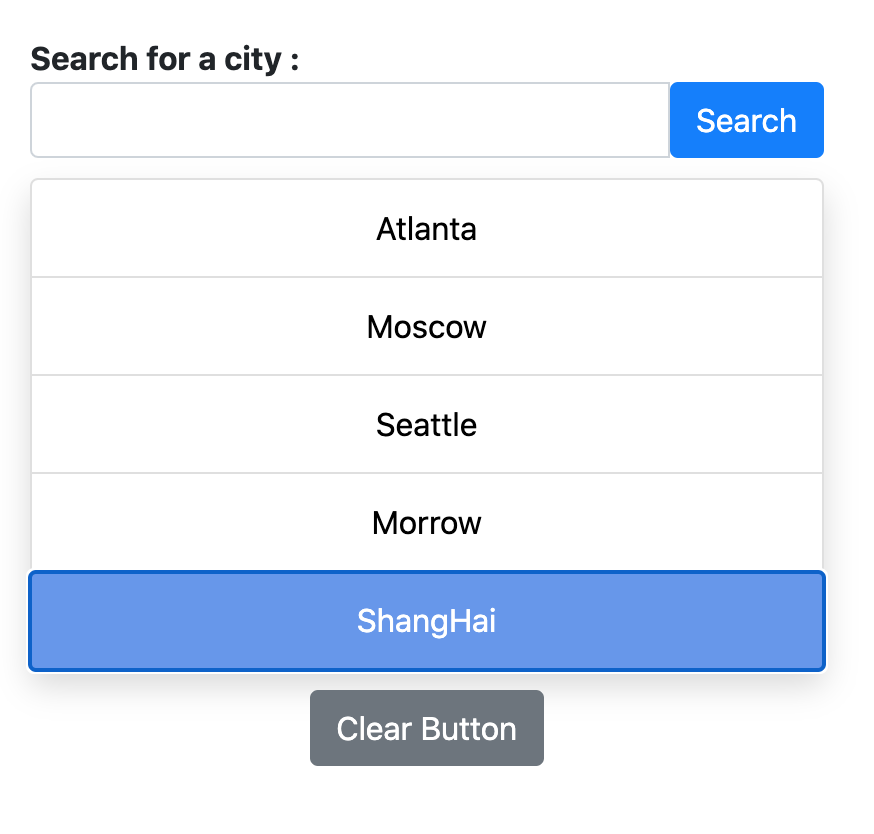

# Project: WEATHER DASHBOARD

<h1>INTRODUCTION</h1>

Developers are often tasked with retrieving data from another application's API and using it in the context of their own. Third-party APIs allow developers to access their data and functionality by making requests with specific parameters to a URL. Your challenge is to build a weather dashboard that will run in the browser and feature dynamically updated HTML and CSS.

Use the [OpenWeather API](https://openweathermap.org/api) to retrieve weather data for cities. The documentation includes a section called "How to start" that will provide basic setup and usage instructions. Use `localStorage` to store any persistent data.

<h1>REQUIREMENTS</h1>

1. user is able to search for a city, that city is added to search history
2. when click on a city, it display weather information and 5 day forecast
3. when refresh the page, the last searched city with its weather info is displayed
4. weather info must contain: temperature, humidity, UV index, icon, date, city name

<h1>PROCEDURES</h1>

1. Pseudo coding
2. Sketch layout
3. Research bootstrap and Jquery selectors
4. HTML
5. Javascript - integrated moment.js and openweather API
6. CSS - integrated Bootstrap and Hover.css

<h1>DETAILS</h1>

1. Utilize local storage to store cities that user searched for and retrieve them when needed (using JSON)
2. Moment.js to find the current date and the date for the next 5 days
3. Use three separate ajax calls: one for the current city weather, one for the UV Index, and one for the 5 day forecast weather info
4. Open weather return 7 days weather info. Starting from the 2nd object is the next day and so on.
5. I addded a few animation effect for hovering over cities, and also a transition effect when user clear the page using code snippet from Stackoverflow. Source: https://stackoverflow.com/questions/23985018/simple-css-animation-loop-fading-in-out-loading-text

<h1>DEMO</h1>

